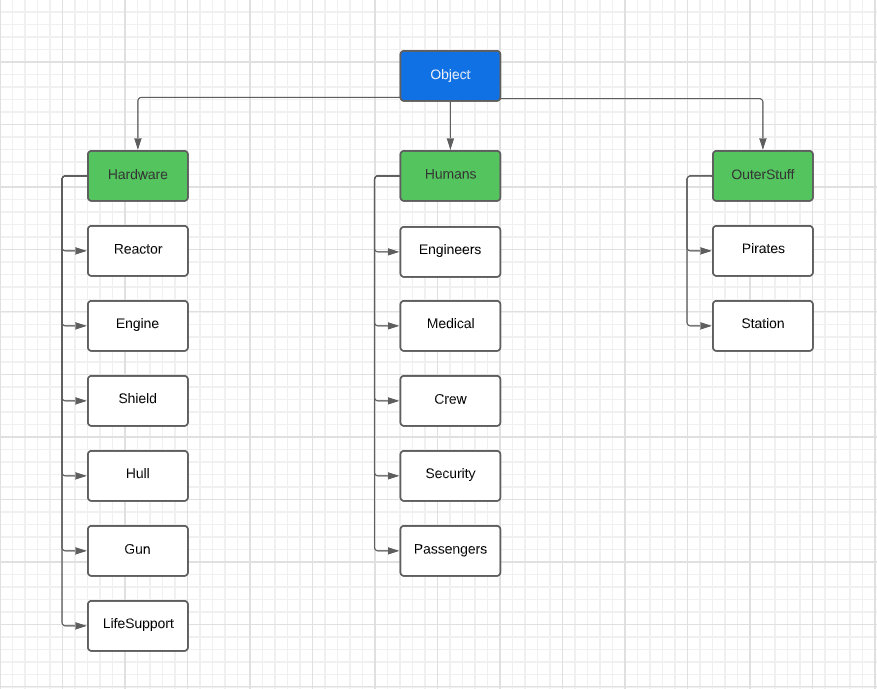

#OOP Lab 3, Inheritance

The simulation uses a hierarchical type of inheretence. 

From the initial object it branches into 3 broad categories (Hardware, Humans, OuterStuff) each containing the simulation actors accordingly.
